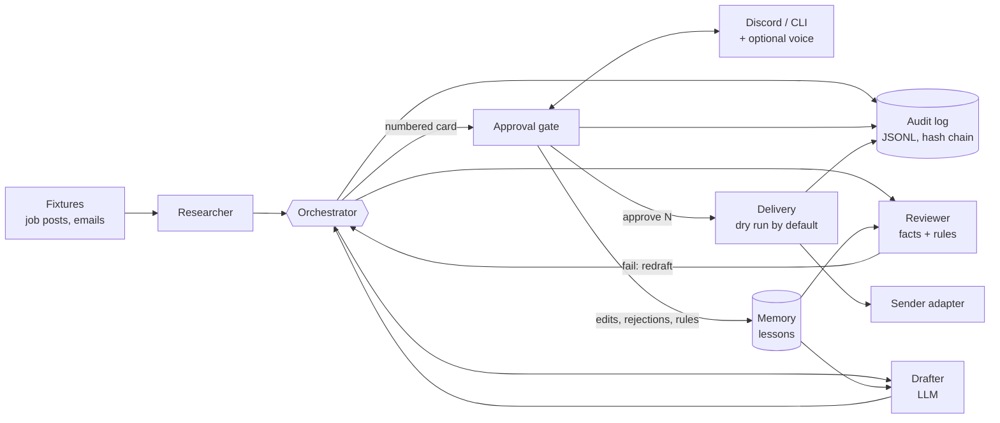
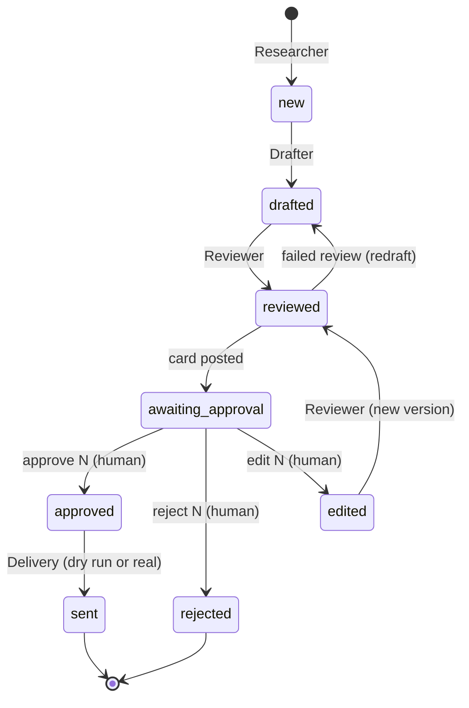

# Human-Approved Agents

[](https://github.com/birneyj1218/human-approved-agents/actions/workflows/ci.yml)
[](https://github.com/birneyj1218/human-approved-agents/actions/workflows/secret-scan.yml)

**AI agents do the work. A person approves anything that leaves the building.**

This is a small multi-agent system you can run on your own machine. One agent finds work (job posts, customer emails), one writes a reply with an LLM, one checks the reply against written rules, and a coordinator moves each item along. Then it stops and asks. Every reply is posted to a Discord channel (or your terminal) as a numbered card, and nothing is sent until the owner types `approve 3`. If they edit the text, the edited version needs its own approval. If they say nothing, nothing happens.

The system remembers what the owner changed and why they rejected things, and feeds that back to the writer next time. It can also take approvals by voice note and read the queue aloud, using speech models running locally on a GPU (or CPU).

The demo uses two fictional businesses: a freelancer answering job posts, and **Blue Gable Roofing** answering customer emails. All input comes from fixture files. Nothing is scraped and nothing is sent.

## Could vs. should

I build automation for small businesses, and my rule is: **test what could be automated, then decide what should be.**

Almost everything here *could* run unattended. A model can find the lead, write the reply and send it in seconds. Whether it *should* depends on what a mistake costs. A wrong internal note costs nothing. A reply that promises a warranty you don't offer, or tells a client you have ten years of experience you don't have, costs trust you can't buy back.

So this project draws the line in a specific place:

| Automated | Kept with a person |
|---|---|
| Finding and filtering incoming work | Deciding what gets sent |
| First drafts and redrafts | Any edit to the text |
| Checking drafts against the facts and rules | Overriding a failed check (not possible: edit instead) |
| Remembering edits and rejections as lessons | Writing the rules |
| Logging every step | Turning sending on (`SEND_ENABLED`) |

The interesting engineering is in making that line hard to cross by accident: approval is per item and per version, tied to a user ID, checked against a hash of the exact text at send time, and recorded in a tamper-evident log.

## How it works



- **Researcher** reads sources (an RSS file of job posts, a JSON export of emails) and keeps the relevant ones. The logo-design post in the fixtures is skipped because it doesn't match the freelancer's keywords.
- **Drafter** writes the reply with any OpenAI-compatible LLM. Its prompt holds the profile's facts, tone, banned phrases and the lessons learned so far.
- **Reviewer** checks the draft with plain code, no LLM: length, banned phrases, every number must appear in the facts or the incoming message, claim words like "licensed", "warranty" or "years" must be backed by a fact, sign-off present, no `[Name]` placeholders. A failed draft goes back to the Drafter with the reasons, up to `MAX_REDRAFTS` times.
- **Orchestrator** moves each item through the state machine below and returns the messages to post, so the same loop runs behind Discord, the CLI and the tests.

Every state change goes through one transition table. Only a human can move an item out of `awaiting_approval`, and only `approved` leads to `sent`.



More detail in [docs/architecture.md](docs/architecture.md).

## Approval rules

The full list, with the reasoning, is in [docs/approval-rules.md](docs/approval-rules.md). The short version:

1. Only user IDs in `APPROVER_USER_IDS` can approve, reject, edit or add lessons. Display names are ignored.
2. `approve N` covers exactly one item and one version. `approve all` approves nothing.
3. "yes", "looks good", "send it" and a thumbs-up are not approvals. Silence is not approval. Nothing times out into approved.
4. `edit N: <text>` creates a new version. It is reviewed again and needs its own approval. `approve N v1` after an edit is refused as stale.
5. A version with a blocking review issue cannot be approved. Edit it or reject it.
6. Approving twice does nothing. A rejected item cannot be approved.
7. Voice approvals must say the version ("approve three version two"), so a misheard number fails safe.
8. The sender recomputes the SHA-256 of the text and refuses to send if it differs from what was approved.

A card looks like this:

```
#3 v2 | freelancer | reply to Priya N. re "Python automation to sync web form leads into our CRM"
Written by: you (edited version)
Review: PASS (43 words)
-----
Hi Priya,

I build workflow automations in Python and n8n, and I write tests for the automations I deliver. ...

Sam Rivera
-----
Reply: approve 3  |  edit 3: <text>  |  reject 3 <reason>
```

## Memory: how the agents learn from the owner

Every decision is stored in SQLite and turned into short lessons the Drafter sees in its next prompt:

- **Edits** are compared with the draft: "Owner shortened a draft from 140 to 70 words; aim for about 70." / "Owner removed the sentence: 'Thanks for the details on ...'". Merged sentences and greetings are not counted as removals.
- **Rejections** keep their reason: "Owner rejected a draft because: too generic; ask which billing tool they use".
- **Rules** are typed directly: `lesson: never say "circle back"`. A "never say" rule also becomes a banned phrase the Reviewer enforces, so it is checked, not just suggested.

Lessons are advice to the model and can be ignored by it; banned phrases cannot. The most recent lessons per profile are used (8 by default), so old ones fade out.

## Voice (optional)

Install with `pip install -e '.[voice]'` to approve by Discord voice note and hear the queue:

- **Speech-to-text:** [faster-whisper](https://github.com/SYSTRAN/faster-whisper). The transcript is mapped to a normal command ("Approve number three, version two" becomes `approve 3 v2`) and goes through the same gate as typed text, with the same allowlist. Voice notes from people not on the allowlist are not transcribed.
- **Text-to-speech:** [Piper](https://github.com/rhasspy/piper). `say queue` replies with a WAV summary ("2 items waiting for approval. Number 3, version 2: ...").
- **Device:** `VOICE_DEVICE=auto` uses CUDA when CTranslate2 can see a GPU and falls back to CPU. If the GPU fails to load the model, it retries on CPU. If the packages or the voice file are missing, voice notes get a short "could not make out that voice note" reply, `say queue` falls back to text, and typed commands keep working.
- Edits by voice are not supported on purpose: dictated text is too easy to mangle for something that gets sent.

Models are not downloaded by the tests or CI. faster-whisper downloads the Whisper model on first use; the Piper voice file you download yourself and point `PIPER_VOICE_PATH` at.

## Try it

Requires Python 3.11 or newer. The demo uses a fake LLM and needs no accounts or network.

```bash
git clone https://github.com/birneyj1218/human-approved-agents.git
cd human-approved-agents
make install     # venv + dev and discord extras (no voice, no torch)
make demo        # or: .venv/bin/python -m human_approved_agents.demo
make check       # lint, types, tests, demo, secret scan
```

What the demo prints (abridged):

```
Reviewer blocked #1 v1 and sent it back to the Drafter:
  - uses banned phrase "I hope this email finds you well"
  - number "25" is not in the facts file
  - claim "years" is not backed by a fact

[someone-else-99] approve 1
You are not on the approver list. Nothing was changed.

[owner-1] looks good
That is not an approval. To send an item reply: approve N

[owner-1] approve 1
Approved #1 v2.

[owner-1] edit 3: Hi Priya, / I build workflow automations in Python and n8n,...
Saved your edit as #3 v2. It will be reviewed and posted for approval. ...

[owner-1] approve 3 v1
#3 v1 is not the current version (v2). Nothing was approved.

[owner-1 (voice)] approve 5
Voice approvals must say the version, e.g. "approve 5 version 1". Nothing was changed.

#1 v2: DRY RUN, not sent (dry-run: would send via console).
#2 got no reply from the human, so it is still waiting. Silence is not approval.

Audit log: 35 entries, audit chain intact.
```

### Run it interactively in the terminal

```bash
cp .env.example .env
set -a; . ./.env; set +a
.venv/bin/haa run --adapter cli
```

### Run it in Discord

1. Create a bot in the Discord developer portal, enable the **Message Content** intent, and invite it to one private channel with Read, Send and Attach Files permissions.
2. In `.env` set `DISCORD_BOT_TOKEN`, `DISCORD_CHANNEL_ID` and `APPROVER_USER_IDS` (your Discord user ID).
3. `.venv/bin/haa run --adapter discord`, or with Docker: set `command: ["haa", "run", "--adapter", "discord"]` in `docker-compose.yml` and `docker compose up -d`.

### Use a real LLM

Set `LLM_PROVIDER=openai` and point `LLM_BASE_URL` at any OpenAI-compatible server: OpenAI, a local [llama.cpp](https://github.com/ggml-org/llama.cpp) server (`http://localhost:8080/v1`), or [Ollama](https://ollama.com) (`http://localhost:11434/v1`). `docker-compose.yml` has a commented Ollama service.

## Configuration

All settings are environment variables (see [`.env.example`](.env.example)). Profiles (facts, tone, rules, source) are TOML files in [`profiles/`](profiles/).

| Variable | Default | What it does |
|---|---|---|
| `APPROVER_USER_IDS` | empty | Comma-separated user IDs allowed to approve. Empty = `haa run` refuses to start |
| `SEND_ENABLED` | `false` | `false` = dry run; approved items are logged, never delivered |
| `SENDER` | `console` | `console` or `file` (JSONL outbox). Write your own adapter for email, a CRM, etc. |
| `MAX_SENDS_PER_HOUR` | `20` | Overall send limit; extra sends wait for the next tick |
| `MAX_COMMANDS_PER_MINUTE` | `10` | Per-user command limit |
| `MAX_REDRAFTS` | `2` | Redrafts after a failed review before the card is shown as BLOCKED |
| `LLM_PROVIDER` | `fake` | `fake` (offline) or `openai` (any OpenAI-compatible API) |
| `LLM_BASE_URL` / `LLM_MODEL` / `LLM_API_KEY` | OpenAI defaults | Endpoint, model and key (key optional for local servers) |
| `DISCORD_BOT_TOKEN` / `DISCORD_CHANNEL_ID` | empty | Discord approver |
| `CLI_USER_ID` | `cli-owner` | Identity of the terminal approver |
| `VOICE_ENABLED` / `VOICE_DEVICE` | `false` / `auto` | Voice on/off; `auto`, `cuda`, `cpu` or `off` |
| `WHISPER_MODEL` / `PIPER_VOICE_PATH` | `small` / empty | Speech models |
| `DATA_DIR` | `data` | SQLite database, audit log, outbox |

## Security model

- **Secrets** come from the environment only, are hidden from `repr()`, and never appear in error messages. Every push runs gitleaks plus a check for private IPs, personal emails, token shapes and Discord-style IDs.
- **Identity** is the user ID the platform reports, checked against an allowlist. A message that says "I'm the owner" is just text.
- **Least power for agents.** The Drafter has no tools. No agent can reach `Delivery` or move an item past `awaiting_approval`; the transition table rejects it.
- **Integrity.** The approved text is hashed at approval time and re-checked at send time.
- **Accountability.** The audit log is append-only JSONL where each line includes the hash of the previous one, so edits and deletions are detectable (`haa verify-audit`). It records who approved what version, denied attempts, and every send with its mode.
- **Safe defaults.** Dry run on, nobody on the allowlist, rate limits on, voice off.
- **Prompt injection.** Incoming emails and job posts are untrusted and go into the Drafter's prompt. The defence is structural: whatever the model writes, the Reviewer checks it and a person approves it before it goes anywhere.

See [SECURITY.md](SECURITY.md).

## Limitations

- **The fact check is a heuristic.** It catches invented numbers and the claim words listed in a profile. It cannot tell whether a sentence without those is true. That is why a person approves every item.
- **Fixtures only.** The Researcher reads local files. Live sources (an email inbox, a job board API) are an adapter away (see [docs/adding-an-agent.md](docs/adding-an-agent.md)), but none ship here, and any real source has terms of service to respect.
- **Senders are console and file.** A real channel (SMTP, a CRM, a job site) needs its own adapter.
- **One process per database.** SQLite and an in-process lock; not built for several workers.
- **The Discord bot's network side is not covered by tests.** Message handling, voice notes and polling are tested with fake Discord objects; the live connection is not.
- **The voice module is tested with fake backends.** CI does not load Whisper or Piper.
- **The Docker image is not built in CI**; CI validates the compose file only.

## Roadmap

- An LLM second-opinion reviewer, non-blocking, shown on the card
- Optional expiry of old items (to rejected, never to approved)
- A setting that requires `approve N vK` from every approver, for teams
- IMAP/SMTP adapters for the email profile
- A small web view of the queue and the audit log

## Project layout

```
src/human_approved_agents/
  agents/          researcher.py, drafter.py, reviewer.py
  approval/        gate.py (rules), commands.py, cards.py, discord_bot.py, cli.py
  voice/           device.py, stt.py (faster-whisper), tts.py (Piper), normalize.py
  orchestrator.py  the loop
  state_machine.py transition table
  memory.py        lessons from edits, rejections, rules
  senders.py       Delivery + console/file senders
  audit.py         append-only JSONL with hash chain
  store.py         SQLite
  llm.py           OpenAI-compatible client + FakeLLM
  demo.py          scripted end-to-end run
profiles/          facts, tone, rules and source per business (TOML)
fixtures/          fictional job posts and emails
docs/              architecture, approval rules, adding an agent
tests/             pytest suite
```

## License

MIT. See [LICENSE](LICENSE).

---

Built by Jim Birney · [evolvaiagents.com](https://evolvaiagents.com) · [github.com/birneyj1218](https://github.com/birneyj1218)
