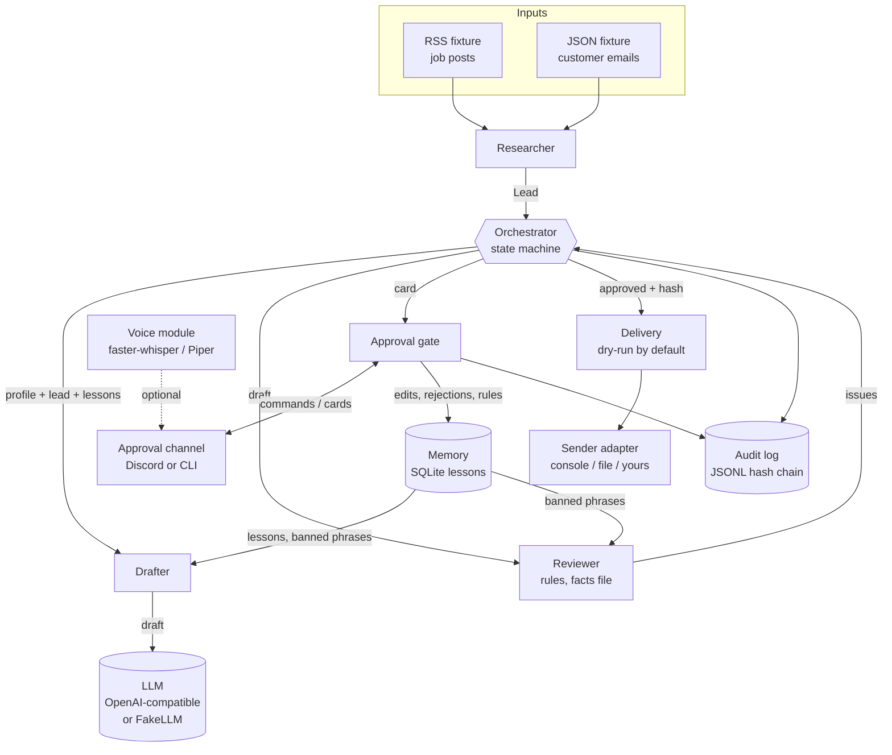

# Architecture

The system is one Python process with four agents, one SQLite file and one append-only log. There is no message bus and no framework: the Orchestrator calls each agent in turn and records the result. That keeps every step testable with plain function calls.

## Components

| Module | Responsibility | Talks to |
|---|---|---|
| `agents/researcher.py` | Read sources, keep relevant leads (per-profile keywords), give each a stable `source_id` | Fixture files |
| `agents/drafter.py` | Build the prompt (task, tone, facts, lessons, banned phrases, reviewer feedback) and call the LLM | `llm.py` |
| `agents/reviewer.py` | Deterministic checks: length, banned phrases, numbers and claim words not backed by facts, sign-off, placeholders, tone warnings | nothing (pure) |
| `orchestrator.py` | Drive items through the state machine; redraft on review failure up to `MAX_REDRAFTS`; render cards; deliver approved items | all of the above |
| `state_machine.py` | The transition table, and which transitions only a human may cause | nothing (pure) |
| `approval/gate.py` | Apply human commands under the [approval rules](approval-rules.md) | store, memory, audit |
| `approval/discord_bot.py`, `approval/cli.py` | Transport: show cards, pass messages to the gate with the sender's user ID | gate via orchestrator |
| `memory.py` | Turn edits, rejections and explicit rules into lessons | store |
| `senders.py` | `Delivery` checks approval, hash, `SEND_ENABLED` and rate limit; `Sender` adapters do the actual delivery | your channel |
| `audit.py` | Append-only JSONL with a SHA-256 chain; `verify()` | file |
| `voice/` | Optional STT/TTS with device selection and graceful fallback | Discord adapter |

## Data

SQLite tables (`store.py`):

- `items`: one row per lead, with state and the approved version, its hash and the approver.
- `versions`: every draft and every human edit, numbered per item, with the review result.
- `decisions`: approved / rejected / edited, by whom, with reason.
- `lessons`: edit, reject and rule lessons, optionally scoped to a profile; `banned_phrase` is set for "never say X" rules.

Versions are never updated after they are written, except to attach their review. A human edit is a new row, which is why an approval can point at exactly one version.

## One tick

1. `ingest()`: the Researcher returns leads; new `(profile, source_id)` pairs become items in `new`.
2. `process()`: for each item in `new`, `drafted`, `edited` or `reviewed`, call the next agent. A failed review sends a Drafter-written version back for a redraft with the reviewer's messages as feedback. Human-written versions are never redrafted. When an item reaches `awaiting_approval`, its card is returned.
3. `deliver()`: each `approved` item goes through `Delivery`. Dry run or real send, it then moves to `sent` with the mode and receipt in the audit log.

The Orchestrator returns messages instead of posting them, so the same loop runs behind Discord, the CLI, the demo and the tests.

## Concurrency

The Discord bot runs the synchronous orchestrator in a worker thread (`asyncio.to_thread`). A re-entrant lock in the Orchestrator and the Store serialises state changes, so a command and a poll cannot interleave halfway through a transition. One process per database is assumed.

## Why deterministic review

The Reviewer could be another LLM call, and that would catch more kinds of problems. It is deterministic on purpose for the first version: its result is explainable on the card ("number 25 is not in the facts file"), it is free, it never has a bad day, and it can be tested exhaustively. An LLM second opinion is on the roadmap as an additional, non-authoritative check.
